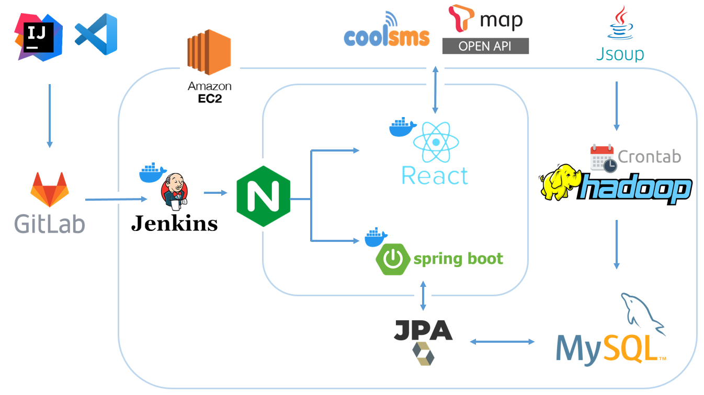
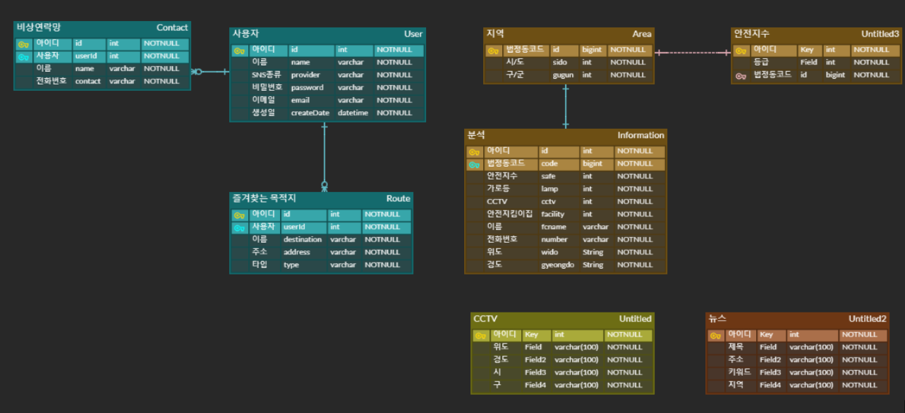

# 기세등등

## 목차

- [프로젝트 소개](#-프로젝트-소개)     
- [팀원 소개](#-팀원-소개)
- [프로젝트 명세](#-프로젝트-명세)
- [개발 환경](#개발-환경)
- [프로젝트 설계](#-프로젝트-설계)
- [주요 기능](#-주요-기능)
- [사용된 기술 목록](#-사용된-기술-목록)
   

## 🙋 프로젝트 소개
> 밤길에도 안전하고 기세등등하게 다닐 수 있도록 가로등의 위치 정보를 이용하여 밝은 길 최단경로를 찾아주는 어플리케이션입니다.
 위험 상황시 사이렌을 울리고 문자를 보내 위험한 상황을 알리거나, 지역에 대해 안전 정보들 또한 제공합니다.

 

## 🤹 팀원 소개

| 김주은                                                       | 박성현                                                  | 오정환                                                  | 전수빈                                                  | 허혜진                                                  |
| ------------------------------------------------------------ | ------------------------------------------------------- | ------------------------------------------------------- | ------------------------------------------------------- | ------------------------------------------------------- |
| front                                        | front                           | back                                                  | back                                                 | front                   |
| [duckygrace@gmail.com](duckygrace@gmail.com)                           | [tirano817@gmail.com](tirano817@gmail.com)                  | [ojh7086@gmail.com](ojh7086@gmail.com)                | [asdfls980511@gmail.com](asdfls980511@gmail.com)            | [heo015414@gmail.com ](heo015414@gmail.com )                |

## ✏️ 프로젝트 명세
<!-- ### 배포 환경 
- __URL__ : https://i5a308.p.ssafy.io
- __배포 여부__ : O
- __접속 가능__ : 접속 가능
- __HTTPS 적용__ : O 
- __PORT__ :  
  - Mysql : 3306
  - Openvidu : 8443
 
 -->
### 개발 환경
#### Front-end
- __Framework__ : [React](https://ko.reactjs.org/)
- __지원 환경__ : Web
- __담당자__ : 김주은 박성현 허혜진

#### Back-end
- __Framework__ : [Spring boot](https://docs.spring.io/spring-boot/docs/current/reference/htmlsingle/)
- __Database__ : [MySQL](https://dev.mysql.com/doc/)
- __담당자__ : 오정환 전수빈

#### Design 
- __Design Tool 사용__ : [Figma](https://www.figma.com/)
- __담당자__ : 김주은 박성현 허혜진 오정환 전수빈

### 핵심 라이브러리 
- Front : React
- Back : JPA, Hiberate, QueryDSL, Lombok

## 🏠 프로젝트 설계

### 프로토타입
- [Figma](https://www.figma.com/file/6CPEvepGjPPIExcrsBqPp2/%EA%B8%B0%EC%84%B8%EB%93%B1%EB%93%B1)

### 서비스 구조

### ERD

### [🖥️ 포팅 매뉴얼](./exec/포팅_메뉴얼.pdf)

### [🔎 시나리오 보기](/exec/scenario.md)

## ❗ 주요 기능

1. **[회원 가입 / 로그인]** 

   - 카카오, 네이버, 구글로 소셜로그인을 할 수 있습니다. 

2. **[메뉴(사이드바)]**

   - 사이드바는 홈, 마이페이지, 안전 지역 정보, 로그아웃으로 구성되어 있습니다.
 

   2-1. **[홈]**
     
   - 가장 위에 있는 현재위치 버튼을 누르면 gps현재위치로 돌아옵니다.
     
   - MODE 의 각 가로등, cctv, 안전지킴이집 버튼을 누르면 현재위치 5km 내의 가로등,cctv 안전지킴이집위치를 볼 수 있습니다.

   2-2. **[길찾기]** 

   - 출발지 목적지 검색을 하면 드롭다운으로 리스트가 뜹니다.

   - 출발지와 목적지를 설정하면 빨간선이 최단경로, 초록선이 가로등 기반의 밝은길로 경로를 안내합니다.

3. **[지역 안전정보 ]** 

   - 구별로 각 지역의 안전지수등급과 cctv, 가로등, 안전지킴이집의 갯수를 확인할수 있습니다

   - 각 지역의 범죄관련 사건기사들을 볼수 있습니다.
   

4. **[마이페이지]** 

   - 비상연락망에 번호를 등록, 삭제 할 수 있습니다.

   - 즐겨찾는 목적지를 등록,삭제할 수 있고
길찾기 버튼을 누르면 현재위치에서 목적지까지 경로를 안내합니다.

5. **[사이렌]**

   - 상단탭 우측 빨강 사이렌 버튼을 누르면 소리가 울리고 끄지 않으면 5초뒤 비상연락망에 등록된 번호에 문자가 갑니다.

## ❗ 사용된 기술 목록

1. 구현 기술 목록 (구현된 모든 기술) : 
      로그인 - 카카오,네이버,구글 소셜로그인 , 로그아웃
      마이페이지 - 비상연락망 등록,삭제,즐겨찾는 경로 추가,삭제
      지역 - 각 시,동으로 검색, 각 지역의 안전지수 등급, 각지역의 가로등,cctv,안전지킴이집 갯수 
        각 지역의 사건 기사 정보(하둡)
      홈 - 가로등표시  on/off, CCTV 표시 on/off , 안전지킴이집 표시 on/off
      길찾기 - 길찾기(최단거리), 안전한 길 찾기, 현위치
      문자 - 사이렌소리 5 초뒤 비상연락망에 등록된 번호에 현재위치 문자 발송 

2. 기술 특이점 (핵심 기술) : 
     뉴스 기사 한달치 크롤링
     Hadoop을 이용해 뉴스 기사 분석
     tmap api 이용해 최단거리와, 안전한 길 추천

3. 특장점 (독창적인 기술) : 
     Jsoup을 이용해 크롤링한 뉴스기사들을 Hadoop을 이용해 맵리듀스알고리즘으로 분석
     가로등 좌표를 이용해 길찾기 알고리즘 작성
     사이렌 울린후 비상연락망에 등록된 번호에 현재위치 문자 발송

